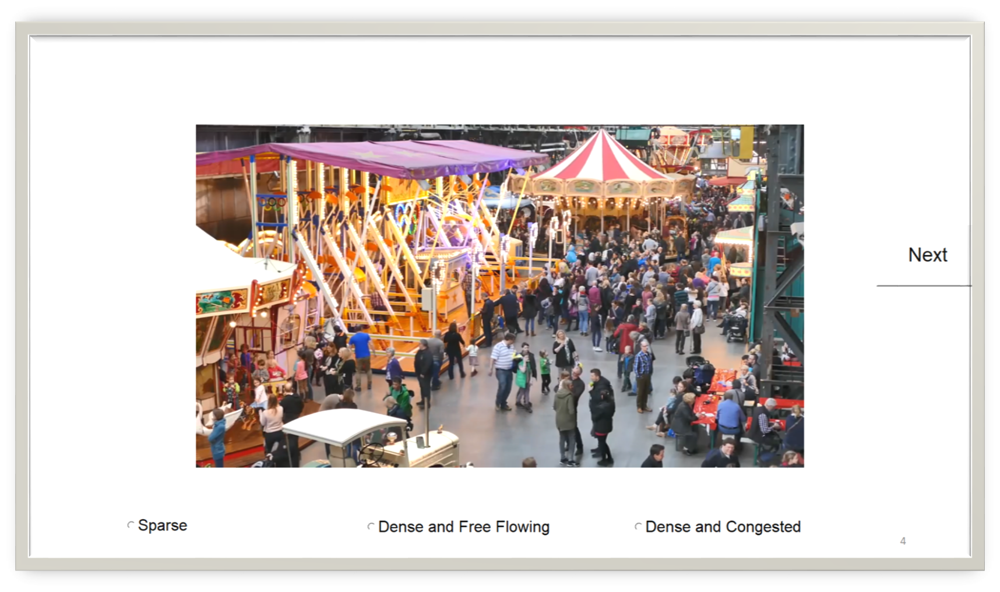

# Video Labelling VBA Application

This is a small VBA based data labelling application for categorizing videos (or images) via PowerPoint.

Screenshot of a sample slide: 

This VBA application was developed to categorize the videos of [CrowdFix](https://github.com/MemoonaTahira/CrowdFix) dataset into three categories: Sparse, Dense and Free Flowing, Dense Congested.

## Workflow: 

1. Start button that will open an excel file to store the responses and open an user from that will asks the observer to enter his name, age bracket and gender. You can add whatever data you need for your analysis here. Double click on any field you wish to change and you will see the backend VBA code. 

2. Next two slides have a set of instructions for the observer. 

3. With one video on each slide with 3 possible lables, one of which the observer has to pick. By default, observer
has to pick one or he won't be allowed to move ahead. Instead he will see a meassge telling him to: "Choose the type of crowd before proceeding" 

4. An end button that will save the updated excel file with the new labels this observer has picked, and safely close the excel file.

## Developer options: 

1. When you start the powerpoint, Allow the "Enable Content" option. 

2. Enable your Developer tools to edit the code. 

3. Add your video to the slides. You can add image or text or whatever else you want labelled as well.  Duplicate slides to add more videos.

4. Right click on the label you want to edit (e.g. to change DC,DF or SP to your own labels), click on property sheet and modify the caption. Also, double clicking on the label will take you to its code where you can look around if you wish to modify it further. 

5. Create an blank excel sheet named "responses.xlsx" Make sure your excel file to store the results is on the path (i.e. in the same folder as the slides) and CLOSED before running the slideshow. The VBA code will automatically call it up.

6. Start the slideshow. Use forward arrow/ mouse click to move forward.

7. If the observer exits slideshow in the middle of the labelling, close the excel sheet from task manager as it will still be active in the background. The previous labels will however be retained in the excel sheet. 

*TODO:* automatically detect ESC (when someone exits slideshow in the middle) and call destroyer to stop excel sheet instance automatically. 

